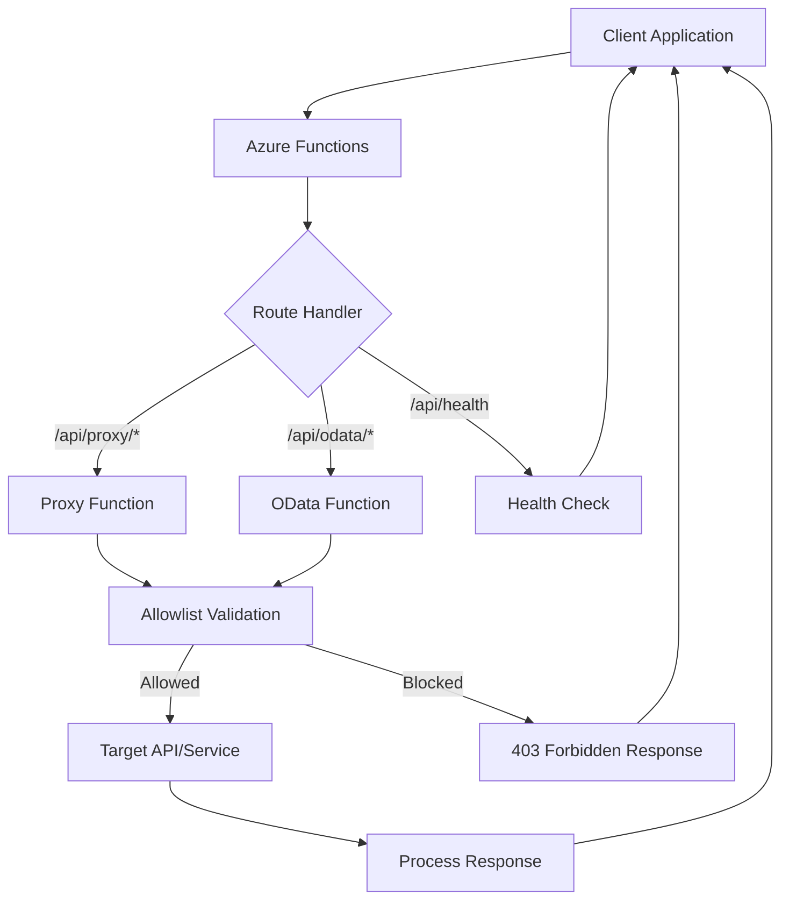
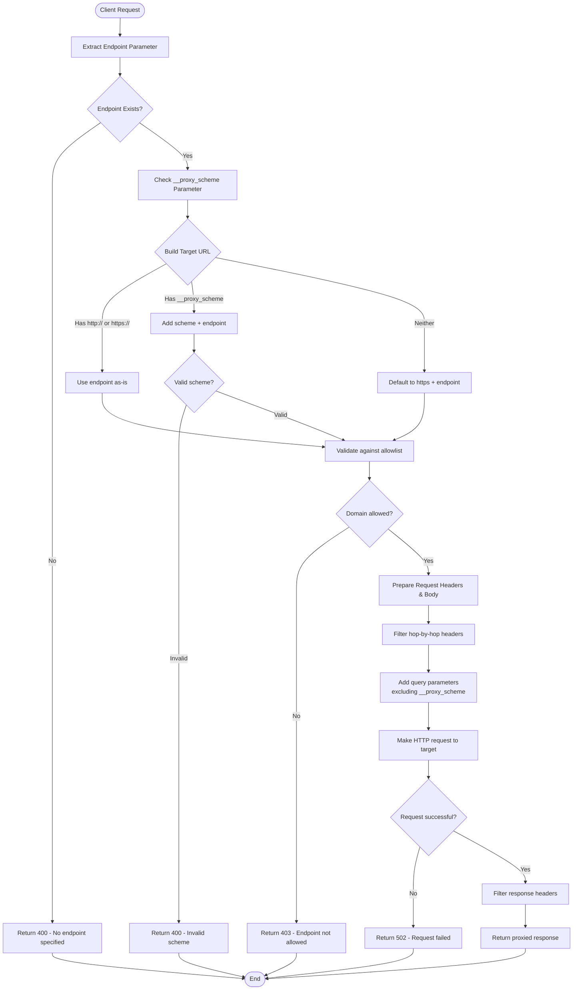
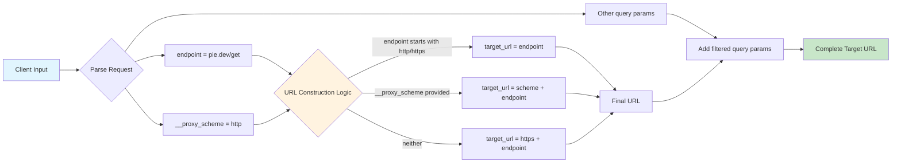
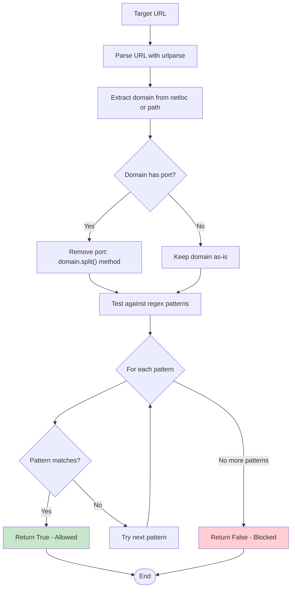

# Azure Functions HTTP Proxy

A secure, configurable HTTP proxy service built with Azure Functions that enables CORS-enabled access to various APIs and services through a single endpoint. Perfect for frontend applications that need to bypass CORS restrictions or access multiple APIs through a unified interface.

## Table of Contents

- [Quick Start](#quick-start)
- [Setting Up Secrets](#setting-up-secrets)
- [Usage Examples](#usage-examples)
- [Deployment](#deployment)
- [API Reference](#api-reference)
- [Configuration](#configuration)
- [Security](#security)
- [Development](#development)
- [Architecture](#architecture)
- [Repository Structure](#repository-structure)
- [Troubleshooting](#troubleshooting)
- [Contributing](#contributing)
- [Security Notice](#security-notice)
- [License](#license)

## Quick Start

### Prerequisites

- Python 3.8+
- Azure Functions Core Tools v4
- Azure CLI (for deployment)
- An Azure Storage Account
- An Azure Application Insights resource (optional but recommended)

### Setting Up Secrets

#### Automated Setup (Recommended)

Use the provided setup script for quick configuration:

```bash
# Interactive setup with prompts for credentials (recommended)
python scripts/setup.py --interactive

# Quick setup with template files
python scripts/setup.py --copy-settings

# Validate existing setup
python scripts/setup.py --validate
```

**VS Code Users**: Use the Command Palette (`Ctrl+Shift+P` / `Cmd+Shift+P`) → "Tasks: Run Task" → Choose from:
- **Setup Development Environment** - Interactive setup with credential prompts
- **Quick Setup (Non-interactive)** - Creates templates and copies settings
- **Copy Settings for Runtime** - Copies settings from .secrets to project root
- **Validate Setup** - Checks your configuration

The setup script will:
- Create the `.secrets/` folder with proper documentation
- Generate a `local.settings.json` template with placeholders
- Optionally prompt for your actual Azure credentials
- Copy settings for the Azure Functions runtime
- Validate your configuration

#### Manual Setup

If you prefer manual setup:

1. **Create the secrets folder** (if not exists):
   ```bash
   mkdir .secrets
   ```

2. **Create local.settings.json** in `.secrets/` with your Azure credentials:
   ```json
   {
     "IsEncrypted": false,
     "Values": {
       "AzureWebJobsStorage": "DefaultEndpointsProtocol=https;AccountName=YOUR_STORAGE_ACCOUNT;AccountKey=YOUR_STORAGE_KEY;EndpointSuffix=core.windows.net",
       "FUNCTIONS_WORKER_RUNTIME": "python",
       "APPLICATIONINSIGHTS_CONNECTION_STRING": "InstrumentationKey=YOUR_INSTRUMENTATION_KEY;IngestionEndpoint=https://YOUR_REGION.in.applicationinsights.azure.com/"
     }
   }
   ```

3. **Get your Azure Storage connection string**:
   - Go to Azure Portal → Storage Accounts → Your Storage Account
   - Navigate to Access Keys → Copy connection string

4. **Get your Application Insights connection string** (optional):
   - Go to Azure Portal → Application Insights → Your App Insights resource
   - Navigate to Properties → Copy Connection String

5. **For deployment, download publish profile**:
   - Go to Azure Portal → Function Apps → Your Function App
   - Click "Get publish profile" and save as `.secrets/profile.publishsettings`

### Local Development

1. **Clone the repository**
   ```bash
   git clone <repository-url>
   cd function-proxy
   ```

2. **Set up development environment**
   ```bash
   # Automated setup (recommended)
   python scripts/setup.py --interactive
   
   # Or quick setup with templates
   python scripts/setup.py --copy-settings
   ```

3. **Install dependencies**
   ```bash
   pip install -r requirements.txt
   ```

4. **Start the local development server**
   ```bash
   func start
   ```

5. **Test the proxy**
   ```bash
   curl "http://localhost:7071/api/proxy/jsonplaceholder.typicode.com/posts/1"
   ```

## Usage Examples

### Basic HTTPS Proxy (Default)
```bash
# Proxy to HTTPS endpoint (default behavior)
curl "https://your-function-app.azurewebsites.net/api/proxy/api.example.com/users"
```

### HTTP Proxy with Scheme Override
```bash
# Proxy to HTTP endpoint using __proxy_scheme parameter (pie.dev is designed for testing)
curl "https://your-function-app.azurewebsites.net/api/proxy/pie.dev/get?__proxy_scheme=http"

# Test POST requests to HTTP endpoints
curl -X POST "https://your-function-app.azurewebsites.net/api/proxy/pie.dev/post?__proxy_scheme=http" \
  -H "Content-Type: application/json" \
  -d '{"test": "data"}'
```

### With Query Parameters
```bash
# Pass through query parameters (excluding __proxy_scheme)
curl "https://your-function-app.azurewebsites.net/api/proxy/jsonplaceholder.typicode.com/posts?userId=1&__proxy_scheme=https"
```

### POST Request with Body
```bash
# Proxy POST requests with JSON body
curl -X POST "https://your-function-app.azurewebsites.net/api/proxy/jsonplaceholder.typicode.com/posts" \
  -H "Content-Type: application/json" \
  -d '{"title":"Test","body":"Test content","userId":1}'
```

### OData Endpoint
```bash
# Specialized OData proxy with proper headers
curl "https://your-function-app.azurewebsites.net/api/odata/services.odata.org/V4/Northwind/Northwind.svc/Products"
```

### Health Check
```bash
# Service health check
curl "https://your-function-app.azurewebsites.net/api/health"
```

## Deployment

### Prerequisites

- Azure CLI installed and logged in
- Azure Functions Core Tools v4
- An Azure subscription

### Option 1: Deploy Using Publish Profile (Recommended for Quick Setup)

1. **Create Function App in Azure Portal**
   - Go to [Azure Portal](https://portal.azure.com)
   - Create a new Function App with Python runtime
   - Download the publish profile from the Function App overview page

2. **Set up deployment credentials**
   - Save the downloaded publish profile as `.secrets/profile.publishsettings`
   - The publish profile contains deployment credentials - keep it secure!

3. **Deploy using VS Code Azure Functions extension**
   - Install the Azure Functions extension
   - Right-click on the project and select "Deploy to Function App"
   - Select your Function App from the list

### Option 2: Deploy Using Azure CLI

1. **Login to Azure**
   ```bash
   az login
   ```

2. **Create a Function App** (if not exists)
   ```bash
   az functionapp create \
     --resource-group myResourceGroup \
     --consumption-plan-location eastus \
     --runtime python \
     --runtime-version 3.9 \
     --functions-version 4 \
     --name myFunctionProxy \
     --storage-account mystorageaccount
   ```

3. **Deploy the function**
   ```bash
   func azure functionapp publish myFunctionProxy
   ```

### Environment Configuration

**For Local Development:**
- Configure `.secrets/local.settings.json` with your Azure Storage and Application Insights connection strings
- Copy to `local.settings.json` for the Functions runtime to pick up

**For Azure Deployment:**
- Configure Application Settings in the Azure Portal (recommended)
- Or set environment variables during deployment

**Required Settings:**
```json
{
  "AzureWebJobsStorage": "Your Azure Storage connection string",
  "FUNCTIONS_WORKER_RUNTIME": "python",
  "APPLICATIONINSIGHTS_CONNECTION_STRING": "Your Application Insights connection string"
}
```

**Where to find these values:**
- **Azure Storage**: Azure Portal → Storage Account → Access Keys
- **Application Insights**: Azure Portal → Application Insights → Properties → Connection String

## API Reference

### Endpoints

| Endpoint | Method | Description |
|----------|--------|-------------|
| `/api/proxy/{*endpoint}` | GET, POST, PUT, DELETE, PATCH | Generic HTTP proxy |
| `/api/odata/{*endpoint}` | GET, POST | OData-specific proxy with proper headers |
| `/api/health` | GET | Health check endpoint |

### Parameters

| Parameter | Description | Example |
|-----------|-------------|---------|
| `__proxy_scheme` | Override the URL scheme (http/https) | `?__proxy_scheme=http` |

### Headers

The proxy forwards most headers but filters out hop-by-hop headers:
- **Filtered out**: `host`, `connection`, `content-length`, `transfer-encoding`
- **Forwarded**: All other headers from the original request

### Response Codes

| Code | Description |
|------|-------------|
| 200-299 | Success (passes through from target) |
| 400 | Bad Request (missing endpoint, invalid scheme) |
| 403 | Forbidden (endpoint not in allowlist) |
| 502 | Bad Gateway (target request failed) |
| 500 | Internal Server Error |

## Configuration

### Allowed Patterns

Configure allowed endpoints in `function_app.py`:

```python
ALLOWED_PATTERNS = [
    "api.example.com",           # Exact domain match
    "services.odata.org",        # Exact domain match
    "jsonplaceholder.*",         # Wildcard subdomain
    "*.trusted.com",             # Wildcard subdomain
    "pie.dev",                   # HTTP testing service
    "httpbin.org",               # HTTP/HTTPS testing service
    "10.0.1.4",                  # IP address
    "localhost",                 # Local development
    "127.0.0.1",                 # Local development
    "*",                         # Allow all (use with caution!)
]
```

**Pattern Types:**
- **Exact match**: `api.example.com`
- **Wildcard**: `*.domain.com` or `subdomain.*`
- **IP addresses**: `10.0.1.4`, `192.168.1.100`
- **Localhost**: `localhost`, `127.0.0.1`

### Security Considerations

1. **Allowlist Configuration**: Always configure a restrictive allowlist for production
2. **HTTPS Verification**: SSL verification is enabled for HTTPS endpoints
3. **Header Filtering**: Sensitive headers are automatically filtered
4. **Request Timeout**: 30-second timeout prevents hanging requests

## Development

### Setup and Development Tools

#### Setup Script
The project includes a comprehensive setup script (`scripts/setup.py`) for easy environment configuration:

```bash
# Interactive setup with credential prompts
python scripts/setup.py --interactive

# Quick setup with templates
python scripts/setup.py --copy-settings

# Validate your setup
python scripts/setup.py --validate
```

#### VS Code Tasks
For VS Code users, several tasks are available via the Command Palette (`Ctrl+Shift+P` / `Cmd+Shift+P`) → "Tasks: Run Task":

| Task Name | Description |
|-----------|-------------|
| **Setup Development Environment** | Interactive setup with credential prompts |
| **Quick Setup (Non-interactive)** | Creates template files and copies settings |
| **Copy Settings for Runtime** | Copies local.settings.json to project root |
| **Validate Setup** | Checks configuration and provides next steps |
| **func: host start** | Starts the Azure Functions development server |

### Project Structure
```
function-proxy/
├── function_app.py          # Main application code
├── requirements.txt         # Python dependencies
├── host.json               # Function host configuration
├── local.settings.json     # Local development settings
├── .funcignore            # Files to ignore during deployment
├── .gitignore             # Git ignore patterns
└── README.md              # This file
```

### Adding New Endpoints

1. **Add route decorator**:
   ```python
   @app.route(route="newapi/{*endpoint}", auth_level=func.AuthLevel.ANONYMOUS)
   def new_api_function(req: func.HttpRequest) -> func.HttpResponse:
       # Implementation
   ```

2. **Update allowlist** if needed
3. **Test locally** with `func start`

### Local testing

```bash
# Make sure you have the local settings configured
cp .secrets/local.settings.json local.settings.json

# Start local development server
func start

# Test different endpoints
curl "http://localhost:7071/api/proxy/httpbin.org/get"
curl "http://localhost:7071/api/health"
curl -X POST "http://localhost:7071/api/proxy/httpbin.org/post" -d "test=data"

# Test HTTP endpoints with pie.dev (designed for testing)
curl "http://localhost:7071/api/proxy/pie.dev/get?__proxy_scheme=http"
curl -X POST "http://localhost:7071/api/proxy/pie.dev/post?__proxy_scheme=http" -d "test=data"
```

## Architecture

### Components

1. **Proxy Function** (`/api/proxy/{*endpoint}`):
   - Generic HTTP proxy supporting all common methods
   - Configurable scheme override via `__proxy_scheme` parameter
   - Allowlist validation
   - Header filtering and forwarding

2. **OData Function** (`/api/odata/{*endpoint}`):
   - Specialized for OData services
   - Automatic OData headers (`Accept`, `OData-Version`)
   - JSON metadata preference

3. **Health Check** (`/api/health`):
   - Simple endpoint for monitoring service health
   - Returns JSON status response

### System Overview



### Proxy Function Request Flow



### URL Construction Logic



### Allowlist Validation Process



### Error Handling

- **Request failures**: Returns 502 with error details
- **Allowlist violations**: Returns 403 with endpoint information
- **Invalid parameters**: Returns 400 with validation errors
- **Internal errors**: Returns 500 with error details

## Repository Structure

```
function-proxy/
├── .git/                    # Git repository metadata
├── .gitignore              # Git ignore patterns (Python, Azure, IDE)
├── .funcignore             # Azure Functions deployment ignore
├── .vscode/                # VS Code workspace configuration
│   └── tasks.json          # VS Code tasks for setup and development
├── .secrets/               # 🔒 SECURE: Contains sensitive configuration files
│   ├── README.md           # Documentation for secrets folder
│   ├── local.settings.json # Local development settings (Azure Storage, App Insights)
│   └── profile.publishsettings # Azure deployment credentials (from portal)
├── .python_packages/       # Python packages cache
├── .venv/                  # Python virtual environment
├── __pycache__/            # Python bytecode cache
├── scripts/                # Setup and utility scripts
│   └── setup.py            # Development environment setup script
├── function_app.py         # Main application logic
├── requirements.txt        # Python dependencies
├── host.json              # Azure Functions host configuration
├── local.settings.json    # Copy of secrets for local runtime (gitignored)
├── LICENSE                # MIT License
└── README.md              # Project documentation
```

### Key Files

- **`function_app.py`**: Core application with proxy logic, allowlist configuration, and route handlers
- **`scripts/setup.py`**: Development environment setup script with interactive configuration
- **`.vscode/tasks.json`**: VS Code tasks for setup, development, and deployment
- **`requirements.txt`**: Minimal dependencies (azure-functions, requests)
- **`host.json`**: Azure Functions runtime configuration with Application Insights
- **`.secrets/local.settings.json`**: Template for local development settings (🔒 contains secrets)
- **`.secrets/profile.publishsettings`**: Azure deployment credentials (🔒 contains secrets)

### Secrets Management

The `.secrets/` folder contains sensitive configuration files that are excluded from version control:

- **Never commit these files** - they contain API keys, connection strings, and deployment credentials
- **Local development**: Copy `.secrets/local.settings.json` to `local.settings.json` when needed
- **Production**: Use Azure Portal Application Settings instead of local files
- **Deployment**: Use publish profile or Azure CLI authentication

## Troubleshooting

### Common Issues

1. **Missing local.settings.json**
   ```
   ERROR: Missing AzureWebJobsStorage setting
   ```
   - Copy configuration: `cp .secrets/local.settings.json local.settings.json`
   - Ensure your `.secrets/local.settings.json` has valid Azure Storage connection string

2. **CORS Errors**
   - Azure Functions automatically handles CORS for HTTP triggers
   - Ensure your frontend domain is configured in Azure portal if needed

3. **Allowlist Rejections**
   ```
   {"error": "Endpoint not allowed: https://blocked-domain.com"}
   ```
   - Add the domain to `ALLOWED_PATTERNS` in `function_app.py`

4. **Scheme Issues with Local IPs**
   ```
   {"error": "Request failed: HTTPSConnectionPool..."}
   ```
   - Use `__proxy_scheme=http` parameter for HTTP endpoints

5. **SSL Verification Errors**
   - SSL verification is automatically disabled for HTTP targets
   - For HTTPS targets with invalid certificates, consider adding custom verification logic

6. **Deployment Credential Issues**
   ```
   ERROR: Failed to deploy to Azure
   ```
   - Ensure `.secrets/profile.publishsettings` is current (download fresh from Azure Portal)
   - Or use `az login` and deploy via Azure CLI

### Debugging

1. **Enable verbose logging**:
   ```python
   logging.basicConfig(level=logging.DEBUG)
   ```

2. **Check Application Insights** for detailed error logs and request traces

3. **Local testing**:
   ```bash
   func start --verbose
   ```

## Contributing

1. Fork the repository
2. Create a feature branch: `git checkout -b feature-name`
3. Make your changes
4. Add tests if applicable
5. Commit your changes: `git commit -am 'Add feature'`
6. Push to the branch: `git push origin feature-name`
7. Submit a pull request

### Development Guidelines

- Follow Python PEP 8 style guidelines
- Add new allowed patterns responsibly
- Include error handling for new features
- Update documentation for API changes

## License

This project is licensed under the MIT License - see the [LICENSE](LICENSE) file for details.

## Security Notice

🔒 **Important Security Information**

### Secrets Management
This project uses a `.secrets/` folder to manage sensitive configuration files:

- **`.secrets/local.settings.json`**: Contains Azure Storage connection strings, Application Insights keys
- **`.secrets/profile.publishsettings`**: Contains Azure deployment credentials
- **`.secrets/README.md`**: Documentation for secrets management

### Security Best Practices
1. **Never commit secrets**: The `.secrets/` folder is excluded from version control
2. **Regenerate exposed credentials**: If any secrets are accidentally exposed, regenerate them immediately
3. **Use Azure Key Vault**: For production deployments, consider using Azure Key Vault for secrets
4. **Restrict allowlist**: Configure `ALLOWED_PATTERNS` restrictively for production environments
5. **Enable authentication**: Consider implementing authentication for sensitive endpoints
6. **Monitor usage**: Use Application Insights to monitor and alert on unusual usage patterns

### Production Deployment Security
- Use Application Settings in Azure Portal instead of local settings files
- Enable Managed Identity for service-to-service authentication
- Configure network restrictions if needed
- Regularly rotate storage account keys and other credentials