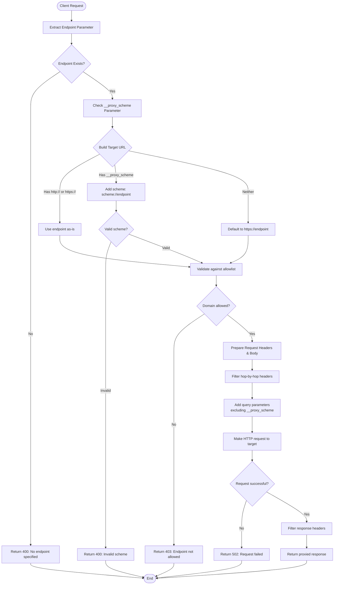

# Azure Functions HTTP Proxy

A secure, configurable HTTP proxy service built with Azure Functions that enables CORS-enabled access to various APIs and services through a single endpoint. Perfect for frontend applications that need to bypass CORS restrictions or access multiple APIs through a unified interface.

## Table of Contents

- [Quick Start](#quick-start)
- [Usage Examples](#usage-examples)
- [Deployment](#deployment)
- [API Reference](#api-reference)
- [Configuration](#configuration)
- [Security](#security)
- [Development](#development)
- [Architecture](#architecture)
- [Repository Structure](#repository-structure)
- [Troubleshooting](#troubleshooting)
- [Contributing](#contributing)
- [License](#license)

## Quick Start

### Prerequisites

- Python 3.8+
- Azure Functions Core Tools v4
- Azure CLI (for deployment)

### Local Development

1. **Clone the repository**
   ```bash
   git clone <repository-url>
   cd function-proxy
   ```

2. **Install dependencies**
   ```bash
   pip install -r requirements.txt
   ```

3. **Start the local development server**
   ```bash
   func start
   ```

4. **Test the proxy**
   ```bash
   curl "http://localhost:7071/api/proxy/jsonplaceholder.typicode.com/posts/1"
   ```

## Usage Examples

### Basic HTTPS Proxy (Default)
```bash
# Proxy to HTTPS endpoint (default behavior)
curl "https://your-function-app.azurewebsites.net/api/proxy/api.example.com/users"
```

### HTTP Proxy with Scheme Override
```bash
# Proxy to HTTP endpoint using __proxy_scheme parameter
curl "https://your-function-app.azurewebsites.net/api/proxy/10.0.1.4:80/data?__proxy_scheme=http"
```

### With Query Parameters
```bash
# Pass through query parameters (excluding __proxy_scheme)
curl "https://your-function-app.azurewebsites.net/api/proxy/jsonplaceholder.typicode.com/posts?userId=1&__proxy_scheme=https"
```

### POST Request with Body
```bash
# Proxy POST requests with JSON body
curl -X POST "https://your-function-app.azurewebsites.net/api/proxy/jsonplaceholder.typicode.com/posts" \
  -H "Content-Type: application/json" \
  -d '{"title":"Test","body":"Test content","userId":1}'
```

### OData Endpoint
```bash
# Specialized OData proxy with proper headers
curl "https://your-function-app.azurewebsites.net/api/odata/services.odata.org/V4/Northwind/Northwind.svc/Products"
```

### Health Check
```bash
# Service health check
curl "https://your-function-app.azurewebsites.net/api/health"
```

## Deployment

### Deploy to Azure

1. **Login to Azure**
   ```bash
   az login
   ```

2. **Create a Function App** (if not exists)
   ```bash
   az functionapp create \
     --resource-group myResourceGroup \
     --consumption-plan-location eastus \
     --runtime python \
     --runtime-version 3.9 \
     --functions-version 4 \
     --name myFunctionProxy \
     --storage-account mystorageaccount
   ```

3. **Deploy the function**
   ```bash
   func azure functionapp publish myFunctionProxy
   ```

### Environment Configuration

Update `local.settings.json` for local development or configure Application Settings in Azure:

```json
{
  "IsEncrypted": false,
  "Values": {
    "AzureWebJobsStorage": "your-storage-connection-string",
    "FUNCTIONS_WORKER_RUNTIME": "python",
    "APPLICATIONINSIGHTS_CONNECTION_STRING": "your-app-insights-connection-string"
  }
}
```

## API Reference

### Endpoints

| Endpoint | Method | Description |
|----------|--------|-------------|
| `/api/proxy/{*endpoint}` | GET, POST, PUT, DELETE, PATCH | Generic HTTP proxy |
| `/api/odata/{*endpoint}` | GET, POST | OData-specific proxy with proper headers |
| `/api/health` | GET | Health check endpoint |

### Parameters

| Parameter | Description | Example |
|-----------|-------------|---------|
| `__proxy_scheme` | Override the URL scheme (http/https) | `?__proxy_scheme=http` |

### Headers

The proxy forwards most headers but filters out hop-by-hop headers:
- **Filtered out**: `host`, `connection`, `content-length`, `transfer-encoding`
- **Forwarded**: All other headers from the original request

### Response Codes

| Code | Description |
|------|-------------|
| 200-299 | Success (passes through from target) |
| 400 | Bad Request (missing endpoint, invalid scheme) |
| 403 | Forbidden (endpoint not in allowlist) |
| 502 | Bad Gateway (target request failed) |
| 500 | Internal Server Error |

## Configuration

### Allowed Patterns

Configure allowed endpoints in `function_app.py`:

```python
ALLOWED_PATTERNS = [
    "api.example.com",           # Exact domain match
    "services.odata.org",        # Exact domain match
    "jsonplaceholder.*",         # Wildcard subdomain
    "*.trusted.com",             # Wildcard subdomain
    "10.0.1.4",                  # IP address
    "localhost",                 # Local development
    "127.0.0.1",                 # Local development
    "*",                         # Allow all (use with caution!)
]
```

**Pattern Types:**
- **Exact match**: `api.example.com`
- **Wildcard**: `*.domain.com` or `subdomain.*`
- **IP addresses**: `10.0.1.4`, `192.168.1.100`
- **Localhost**: `localhost`, `127.0.0.1`

### Security Considerations

1. **Allowlist Configuration**: Always configure a restrictive allowlist for production
2. **HTTPS Verification**: SSL verification is enabled for HTTPS endpoints
3. **Header Filtering**: Sensitive headers are automatically filtered
4. **Request Timeout**: 30-second timeout prevents hanging requests

## Development

### Project Structure
```
function-proxy/
├── function_app.py          # Main application code
├── requirements.txt         # Python dependencies
├── host.json               # Function host configuration
├── local.settings.json     # Local development settings
├── .funcignore            # Files to ignore during deployment
├── .gitignore             # Git ignore patterns
└── README.md              # This file
```

### Adding New Endpoints

1. **Add route decorator**:
   ```python
   @app.route(route="newapi/{*endpoint}", auth_level=func.AuthLevel.ANONYMOUS)
   def new_api_function(req: func.HttpRequest) -> func.HttpResponse:
       # Implementation
   ```

2. **Update allowlist** if needed
3. **Test locally** with `func start`

### Testing

```bash
# Start local development server
func start

# Test different endpoints
curl "http://localhost:7071/api/proxy/httpbin.org/get"
curl "http://localhost:7071/api/health"
curl -X POST "http://localhost:7071/api/proxy/httpbin.org/post" -d "test=data"
```

## Architecture

### Components

1. **Proxy Function** (`/api/proxy/{*endpoint}`):
   - Generic HTTP proxy supporting all common methods
   - Configurable scheme override via `__proxy_scheme` parameter
   - Allowlist validation
   - Header filtering and forwarding

2. **OData Function** (`/api/odata/{*endpoint}`):
   - Specialized for OData services
   - Automatic OData headers (`Accept`, `OData-Version`)
   - JSON metadata preference

3. **Health Check** (`/api/health`):
   - Simple endpoint for monitoring service health
   - Returns JSON status response

### System Overview


### Proxy Function Request Flow



### URL Construction Logic

```mermaid
flowchart LR
    Input[Client Input] --> Parse{Parse Request}
    
    Parse --> Endpoint[endpoint: "10.0.1.4:80/data"]
    Parse --> Param[__proxy_scheme: "http"]
    Parse --> Query[Other query params]
    
    Endpoint --> Logic{URL Construction Logic}
    Param --> Logic
    
    Logic -->|endpoint starts with http/https| Direct["target_url = endpoint"]
    Logic -->|__proxy_scheme provided| Scheme["target_url = scheme://endpoint"]
    Logic -->|neither| Default["target_url = https://endpoint"]
    
    Direct --> Final[Final URL]
    Scheme --> Final
    Default --> Final
    
    Query --> AddQuery[Add filtered query params]
    Final --> AddQuery
    AddQuery --> Result[Complete Target URL]
    
    style Input fill:#e1f5fe
    style Result fill:#c8e6c9
    style Logic fill:#fff3e0
```

### Allowlist Validation Process

```mermaid
flowchart TD
    URL[Target URL] --> Parse[Parse URL with urlparse]
    Parse --> Extract[Extract domain from netloc or path]
    Extract --> CheckPort{Domain has port?}
    
    CheckPort -->|Yes| RemovePort[Remove port: domain.split(':')[0]]
    CheckPort -->|No| KeepDomain[Keep domain as-is]
    
    RemovePort --> TestPatterns[Test against regex patterns]
    KeepDomain --> TestPatterns
    
    TestPatterns --> Loop{For each pattern}
    Loop --> Match{Pattern matches?}
    
    Match -->|Yes| Allow[Return True: Allowed]
    Match -->|No| NextPattern[Try next pattern]
    
    NextPattern --> Loop
    Loop -->|No more patterns| Deny[Return False: Blocked]
    
    Allow --> End([End])
    Deny --> End
    
    style Allow fill:#c8e6c9
    style Deny fill:#ffcdd2
```

### Error Handling

- **Request failures**: Returns 502 with error details
- **Allowlist violations**: Returns 403 with endpoint information
- **Invalid parameters**: Returns 400 with validation errors
- **Internal errors**: Returns 500 with error details

## Repository Structure

```
function-proxy/
├── .git/                    # Git repository metadata
├── .gitignore              # Git ignore patterns (Python, Azure, IDE)
├── .funcignore             # Azure Functions deployment ignore
├── .vscode/                # VS Code workspace configuration
├── .python_packages/       # Python packages cache
├── .venv/                  # Python virtual environment
├── __pycache__/            # Python bytecode cache
├── function_app.py         # Main application logic
├── requirements.txt        # Python dependencies
├── host.json              # Azure Functions host configuration
├── local.settings.json    # Local development settings (contains secrets)
├── profile.publishsettings # Azure publish profile (contains secrets)
├── LICENSE                # MIT License
└── README.md              # Project documentation
```

### Key Files

- **`function_app.py`**: Core application with proxy logic, allowlist configuration, and route handlers
- **`requirements.txt`**: Minimal dependencies (azure-functions, requests)
- **`host.json`**: Azure Functions runtime configuration with Application Insights
- **`local.settings.json`**: Local development settings (⚠️ contains secrets, not in git)

## Troubleshooting

### Common Issues

1. **CORS Errors**
   - Azure Functions automatically handles CORS for HTTP triggers
   - Ensure your frontend domain is configured in Azure portal if needed

2. **Allowlist Rejections**
   ```
   {"error": "Endpoint not allowed: https://blocked-domain.com"}
   ```
   - Add the domain to `ALLOWED_PATTERNS` in `function_app.py`

3. **Scheme Issues with Local IPs**
   ```
   {"error": "Request failed: HTTPSConnectionPool..."}
   ```
   - Use `__proxy_scheme=http` parameter for HTTP endpoints

4. **SSL Verification Errors**
   - SSL verification is automatically disabled for HTTP targets
   - For HTTPS targets with invalid certificates, consider adding custom verification logic

### Debugging

1. **Enable verbose logging**:
   ```python
   logging.basicConfig(level=logging.DEBUG)
   ```

2. **Check Application Insights** for detailed error logs and request traces

3. **Local testing**:
   ```bash
   func start --verbose
   ```

## Contributing

1. Fork the repository
2. Create a feature branch: `git checkout -b feature-name`
3. Make your changes
4. Add tests if applicable
5. Commit your changes: `git commit -am 'Add feature'`
6. Push to the branch: `git push origin feature-name`
7. Submit a pull request

### Development Guidelines

- Follow Python PEP 8 style guidelines
- Add new allowed patterns responsibly
- Include error handling for new features
- Update documentation for API changes

## License

This project is licensed under the MIT License - see the [LICENSE](LICENSE) file for details.

## Security Notice

⚠️ **Important**: The `local.settings.json` and `profile.publishsettings` files contain sensitive information and should never be committed to version control. They are included in `.gitignore` for this reason.

When deploying to production:
1. Configure allowed patterns restrictively
2. Use Application Settings in Azure portal instead of local.settings.json
3. Enable Application Insights for monitoring
4. Consider implementing authentication for sensitive endpoints